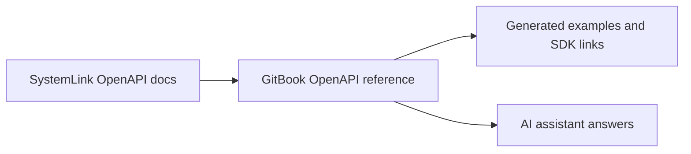

# SystemLink API

The SystemLink API gives teams programmatic access to test system data and operations outside the SystemLink web application.

## API surface

<table data-view="cards"><thead><tr><th></th><th></th></tr></thead><tbody>
<tr><td><i class="fa-boxes-stacked" style="color:$primary;">:boxes-stacked:</i> <strong>Assets</strong></td><td>Asset identity, location, presence, calibration, and connection history.</td></tr>
<tr><td><i class="fa-vial-circle-check" style="color:$primary;">:vial-circle-check:</i> <strong>Tests</strong></td><td>Results, steps, measurements, limits, and execution metadata.</td></tr>
<tr><td><i class="fa-chart-simple" style="color:$primary;">:chart-simple:</i> <strong>Data services</strong></td><td>Query and manage data produced by test systems.</td></tr>
<tr><td><i class="fa-code" style="color:$primary;">:code:</i> <strong>Clients</strong></td><td>Python, .NET, HTTP, and G access patterns.</td></tr>
</tbody></table>

## OpenAPI-first reference

