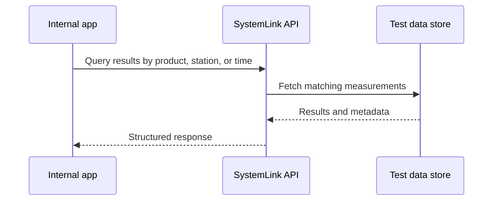

# Test results

Test result APIs support analytics, dashboards, traceability, and operational reporting across labs and production systems.

## Retrieval flow



## Good docs examples



```python
from nisystemlink.clients import core

# Authenticate with the configured SystemLink environment.
client = core.HttpClient()
```



```bash
curl -H "Authorization: Bearer $SYSTEMLINK_TOKEN" \
  "$SYSTEMLINK_URL/api/test-results"
```



