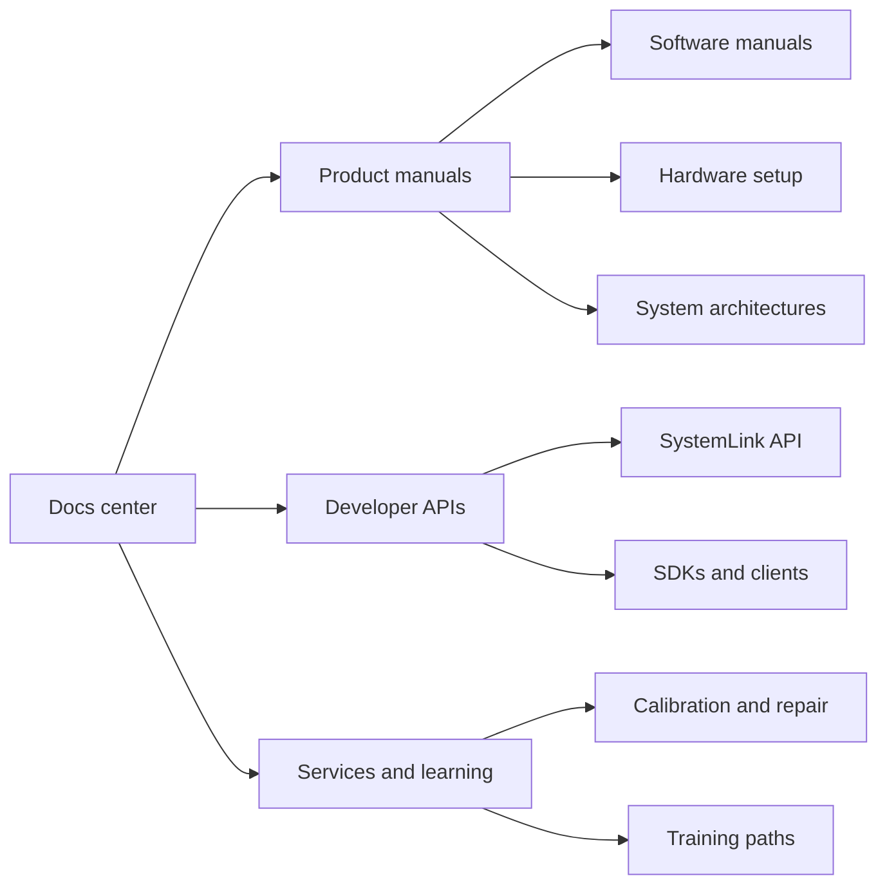

# Catalog model

The NI documentation center has to support several reader intents at once: a technician with hardware on a bench, a LabVIEW user building a measurement workflow, an enterprise admin operating SystemLink, and a developer looking for an API contract.


The demo keeps NI's current product-led catalog, but the navigation is grouped by reader job instead of by one flat index.


## Space strategy

| Space | Purpose | Example reader |
| --- | --- | --- |
| Product Manuals | Install, configure, and operate NI products | Test engineer or lab technician |
| Developer APIs | Integrate with SystemLink and automate workflows | Software engineer |
| Services and Learning | Get help, calibrate hardware, and build team capability | Operations owner or lab manager |
| Docs Center | Global homepage, search, translations, and migration story | Any visitor |

