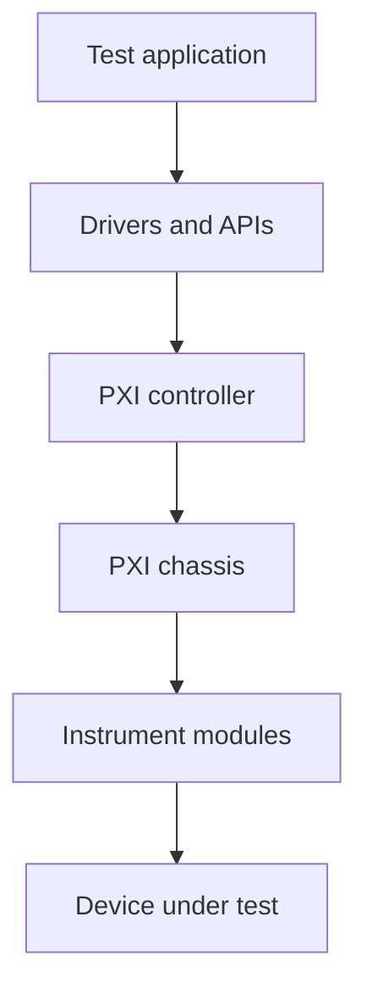

# PXI test systems

PXI systems are used for high-performance automated test, validation, and measurement. A docs experience for PXI should connect chassis setup, instrument manuals, software drivers, and maintenance guidance.

## System layers

## Validation checklist

| Check | Why |
| --- | --- |
| Chassis and controller compatibility | Avoid unsupported module or bandwidth configurations |
| Driver version | Keep software validated with deployed test sequences |
| Calibration status | Ensure measurement accuracy and audit readiness |
| Thermal and power budget | Prevent intermittent behavior during long runs |

