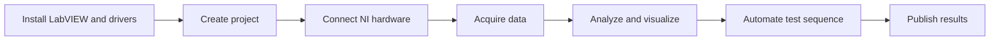

# LabVIEW development workflow

LabVIEW is systems engineering software for applications that require test, measurement, and control with rapid access to hardware and data insights.

## Workflow

## Quick checklist



Install LabVIEW and the required device drivers, such as NI-DAQmx for data acquisition devices.



Open or create a project and add the devices, channels, and dependencies for the test system.



Verify hardware communication in MAX before building the full measurement application.



Capture, analyze, and save measurement results with a documented version of the software stack.



